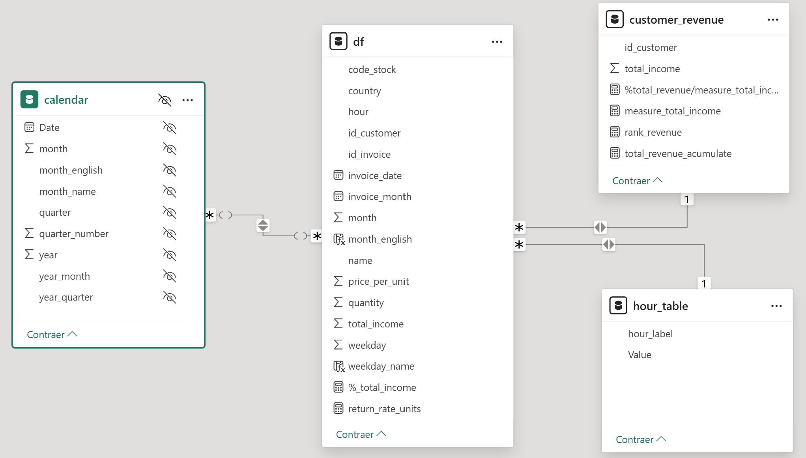
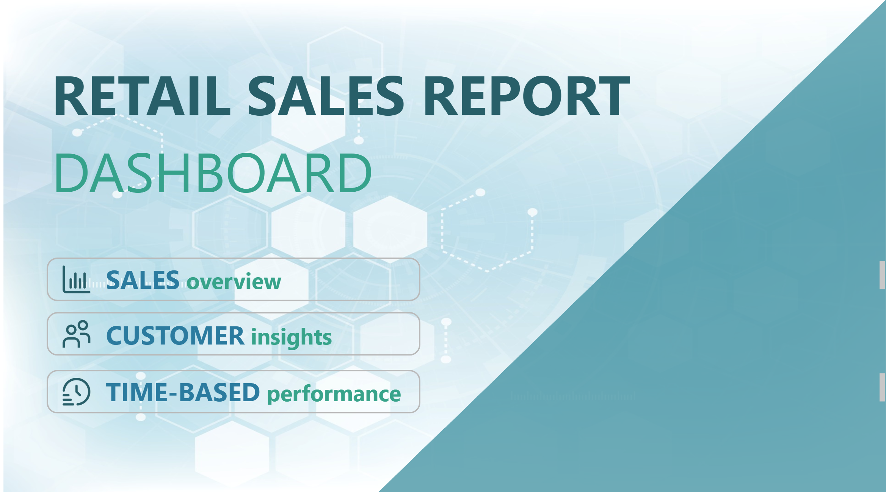
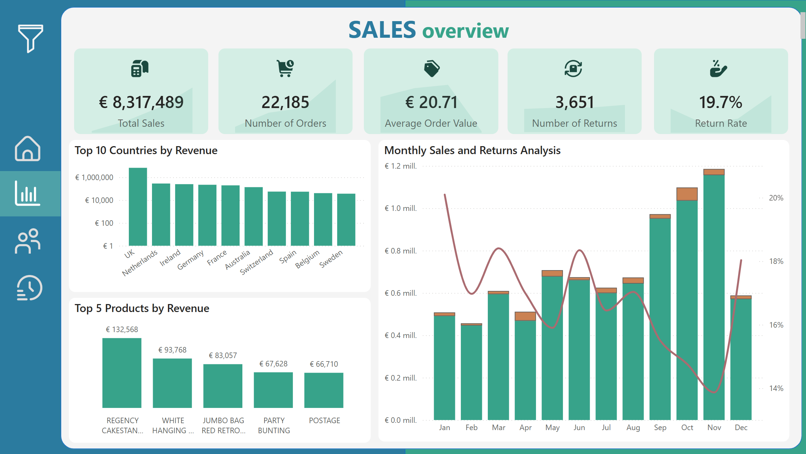
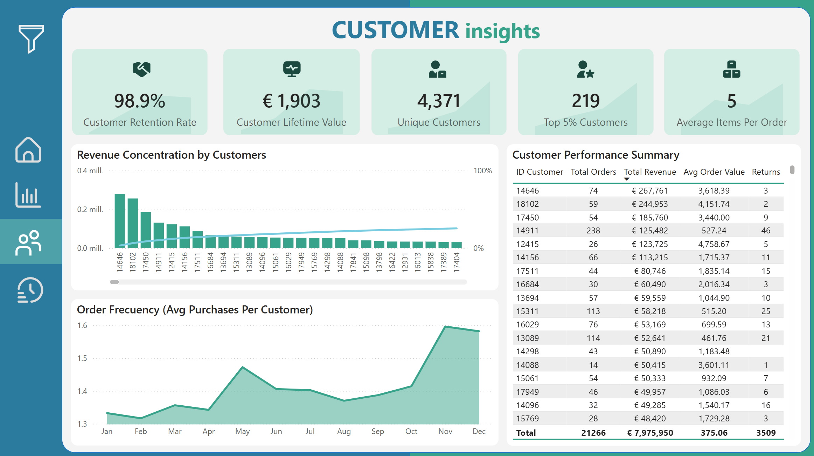
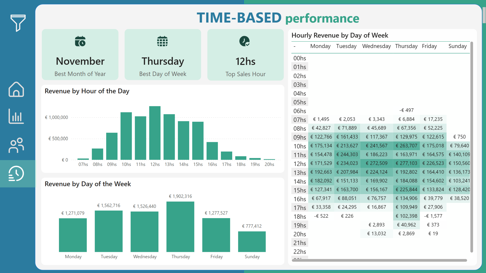

# Retail Sales

---
       

## Introduction
This project focuses on analyzing transactional data from a retail store to discover business performance insights. The main goal is to evaluate operational and marketing metrics using a full data pipeline — from extraction to visualization — and a dynamic Power BI dashboard powered by DuckDB and SQL transformations.
The final goal is to support the CEO and CMO in making informed decisions by presenting revenue indicators, customer segments, return trends, and time-based performance based on transactional data of the fiscal year in question.

## Problem Statement
Retailers use to face the challenge of handling a large quantity of data without transforming it into business value. In this project, the company looks for:

- A deep understanding of revenue sources.
- Identification of top-performing products, customers, and countries.
- Clear metrics around returns and customer retention.
- A dashboard that provides both operational and marketing perspectives.

This project addresses those needs through an end-to-end pipeline and a data storytelling dashboard, made for long-term planning.

## Business Objectives
### Revenue Analysis
Revenue streams were analyzed by analyzing product performance, customer segments, key sales and return indicators, and contribution by country.
### Customer Insights
Measure customer retention analyzed, top buyers, revenue concentration (Pareto), and calculate a basic Customer Lifetime Value (CLV) to support acquisition and loyalty strategies.
### Time-Based Performance
All indicators and important information about trends in times when customers interact most and least with the company.

## Project Pipeline

### Data Extraction
- Dataset named "tata-online-retail-dataset" downloaded from Kaggle using the Kaggle API.
- API key created in the official website and kaggle.json configured manually on local environment.
- Python file named "extract.py".

### Loading into DuckDB
- CSV file loaded and transformed into a DuckDB database.
- Cleaned and structured using Python scripts.
- Python file named "load_to_duckdb.py"

### Transformation with DBT (SQL)
- Business logic applied through SQL-based transformations (e.g., "country" column data changed using CASE WHEN logic)
- Also in python file named "load_to_duckdb.py"

### Exploratory Analysis (EDA)
- Conducted in Jupyter Notebook to validate and explore variables like sales trends, returns, customer behavior and correlations between data.

### Dashboard in Power BI
- Dataset exported in PBIX format, as I do not have a premium account.
- Dashboard designed for executive-level storytelling, different pages and performance indicators.

## Skills / Concepts Demonstrated
- End-to-end data pipeline creation (ETL/ELT).
- Python scripting for automation.
- DuckDB as a fast, embedded analytical engine.
- SQL transformation with DBT for practice.
- Exploratory Data Analysis (EDA) in Jupyter Notebook.
- Power BI visualization and DAX modeling
- KPI creation: Return Rate, Customer Retention, CLV, Pareto, Peak Sales Hour, Top 5% Revenue, etc.

## Modelling

The model is a star schema. There are 1 dimension table (df), 1 calendar table and 2 fact table made only for different graphs and KPI's.

## Visualization

The report consists in 1 front page and 3 sections with different information.

Page name: Front Page

Page name: Sales Overview

Page name: Customer Insights

Page name: Time-Based Performance

## Dashboard Features - Key Components

1. Revenue KPIs

   - Total Revenue, Average revenue per Customer (ARPC), and Top 5 Products by Revenue

    `total_sales_value = 
CALCULATE(
    SUM('df'[total_income]),
    'df'[quantity] > 0
  )`

2. Return Rate Analysis

   - Percentage of returned products (units and rate), financial impact visualized

   `total_returns_value = 
CALCULATE(
    ABS(SUM('df'[total_income])),
    'df'[quantity] < 0
)`
   
3. Customer Retention

   - One-time vs. repeat buyer ratio and Order frecuency throughout the year
   
   `customer_retention_rate = 
VAR TotalCustomers =
    CALCULATE(
        DISTINCTCOUNT('df'[id_customer])
    )
VAR RepeatCustomers =
    CALCULATE(
        DISTINCTCOUNT('df'[id_customer]),
        FILTER(
            'df',
            CALCULATE(COUNTROWS('df'), ALLEXCEPT('df', 'df'[id_customer])) > 1
        )
    )
RETURN DIVIDE(RepeatCustomers, TotalCustomers)`
   
   `order_frequency = 
DIVIDE([total_orders], [unique_customers])`
   
4. Top 5% Customers
   - High-value quantity of customers identified
     
     `top_5%_customers_count = 
VAR CustomerTable =
    SUMMARIZE(
        'df',
        'df'[id_customer],
        "total_income", SUM('df'[total_income])
VAR Percentile95 =
    PERCENTILEX.INC(CustomerTable, [total_income], 0.95)
RETURN
    COUNTROWS(
        FILTER(
            CustomerTable,
            [total_income] >= Percentile95
        )
    )
`
   
5. Pareto 80/20 Analysis
   
    - Share of revenue generated by top 20% of customers

      `%total_revenue/measure_total_income = [total_revenue_acumulate]/CALCULATE([measure_total_income], ALL(customer_revenue[id_customer]))`
   
6. Customer Lifetime Value
   
    - CLV estimated using average revenue per customer

      `avg_revenue_per_customer = 
DIVIDE([total_revenue], [total_customers])`
    
7. Time-Based Sales Trends
    
    - Revenue by hour, weekday, and month to identify peak sales windows

      `best_month_of_year_name = 
VAR RevenueByMonth =
    ADDCOLUMNS(
        VALUES('df'[month]),
        "Revenue", CALCULATE(SUM('df'[total_income]))
    )
VAR TopMonth =
    TOPN(1, RevenueByMonth, [Revenue], DESC)
VAR BestMonthNumber =
    SELECTCOLUMNS(TopMonth, "BestMonth", 'df'[month])
RETURN
    SWITCH(
        TRUE(),
        BestMonthNumber = 1, "January",
        BestMonthNumber = 2, "February",
        BestMonthNumber = 3, "March",
        BestMonthNumber = 4, "April",
        BestMonthNumber = 5, "May",
        BestMonthNumber = 6, "June",
        BestMonthNumber = 7, "July",
        BestMonthNumber = 8, "August",
        BestMonthNumber = 9, "September",
        BestMonthNumber = 10, "October",
        BestMonthNumber = 11, "November",
        BestMonthNumber = 12, "December",
        "Unknown"
    )`

      `best_day_of_week_name = 
VAR RevenueByDay =
    ADDCOLUMNS(
        VALUES('df'[weekday]),
        "Revenue", CALCULATE(SUM('df'[total_income]))
    )
VAR TopDay =
    TOPN(1, RevenueByDay, [Revenue], DESC)
VAR BestDayNumber =
    SELECTCOLUMNS(TopDay, "BestDay", 'df'[weekday])
RETURN
    SWITCH(
        TRUE(),
        BestDayNumber = 1, "Monday",
        BestDayNumber = 2, "Tuesday",
        BestDayNumber = 3, "Wednesday",
        BestDayNumber = 4, "Thursday",
        BestDayNumber = 5, "Friday",
        BestDayNumber = 6, "Saturday",
        BestDayNumber = 7, "Sunday",
        "Unknown"
    )`

      `peak_sales_hour = 
VAR RevenueByHour =
    ADDCOLUMNS(
        VALUES('df'[hour]),
        "Revenue", CALCULATE(SUM('df'[total_income]))
    )
VAR TopHour =
    TOPN(1, RevenueByHour, [Revenue], DESC)
VAR BestHour =
    SELECTCOLUMNS(TopHour, "Peak", 'df'[hour])
RETURN
    FORMAT(BestHour, "00") & "hs"
`
    
8. Geographical Insights
    
    - Country-level sales distribution to support regional growth strategy

## Findings and Insights

1) Revenue Drivers

   - The products REGENCY CAKESTAND 3 TIER, WHITE HANGING HEART T-LIGHT HOLDER, JUMBO BAG RED RETROSPORT, PARTY BUNTING, POSTAGE, ASSORTED COLOUR BIRD ORNAMENT, RABBIT NIGHT LIGHT, CHILLI LIGHTS, PAPER CHAIN KIT 50'S CHRISTMAS and PICNIC BASKET WICKER 60 PIECES  generate over 8.16% of total revenue (of 3886 different items).
   - The most profitable item is: REGENCY CAKESTAND 3 TIER.
   
2) Returns Behavior

   - Returns represent approximately 19.7% of units and 16.5% of revenue, mostly occurring during the last quarter of the year.
   
3) Customer Retention

   - Around 98.9% of customers are repeat buyers, indicating opportunities for targeted loyalty efforts.
   
4) Revenue Concentration

   - The top 1% of customers generate 31.75% of revenue.
   
5) Time Trends

   - Highest revenue observed between [11am–3pm] and on [Fridays], suggesting optimal promotion windows.
    
6) Geographic Trends

   - Strong sales in countries like United Kingdom (83.4% of total revenue) and Netherlands, Ireland, Germany, etc, indicating potential for localized marketing and logistics improvements.
    
## Conclusion & Recommendations

